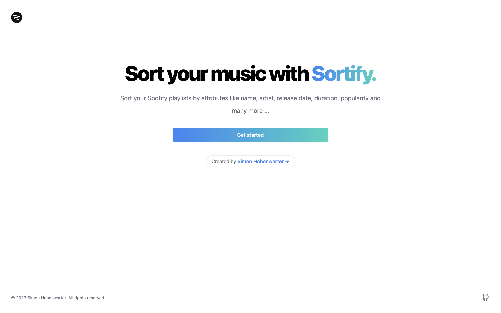
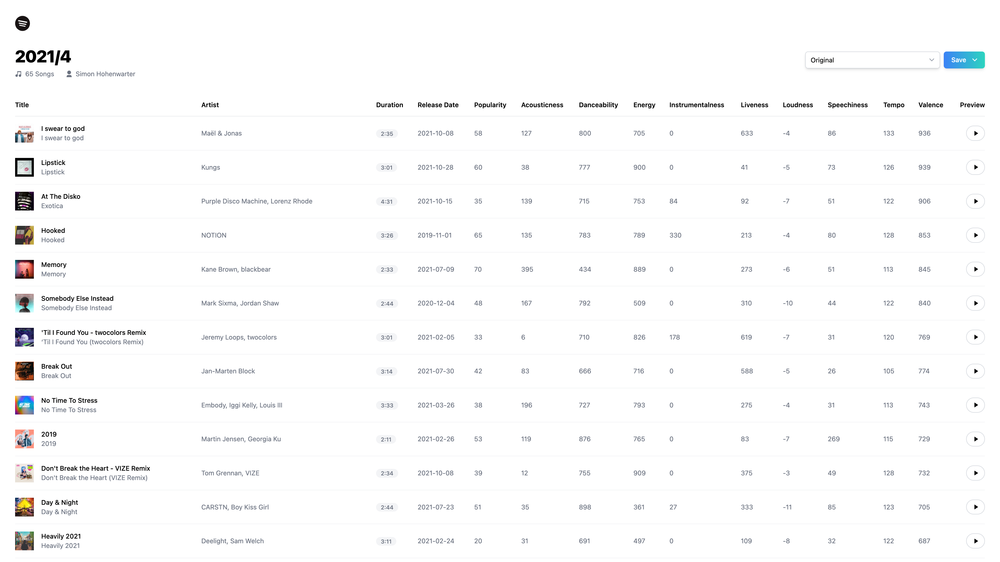

# Sortify

  
  

> **Warning**
> Sortify is still in Spotify's [development mode](https://developer.spotify.com/documentation/web-api/concepts/quota-modes), which means only users on the app's allowlist can use it.

## What is Sortify and what can it do?

Sortify is a service that lets you sort your Spotify playlists by attributes like name, artist, release date, duration, popularity, danceability and many more ...

Here are all attributes by which you can currently sort your playlists in either ascending or descending order:

- Title
- Artist
- Duration
- Release Date
- Popularity
- Acousticness
- Danceability
- Energy
- Instrumentalness
- Liveness
- Loudness
- Speechiness
- Tempo
- Valence

Here is how it looks when you want to sort a playlist:

In the upper right corner there are two dropdown menus. The first is for selecting by which attribute you would like to sort the playlist. The second one is for saving the playlist. Here you have the choice to either overwrite the existing playlist or to save the changes as a new playlist.

## How does it work?

Sortify uses OAuth 2.0 to authenticate the user and access and modify the users public and private playlists via Spotifys web API.

## What technologies are used?

- **Framework**: [Next.js](https://nextjs.org/)
- **Styling**: [Tailwind CSS](https://tailwindcss.com)
- **Components**: [Headless UI](https://headlessui.com/)
- **Authentication**: [NextAuth.js](https://next-auth.js.org)
- **Data Fetching**: [SWR](https://swr.vercel.app/)
